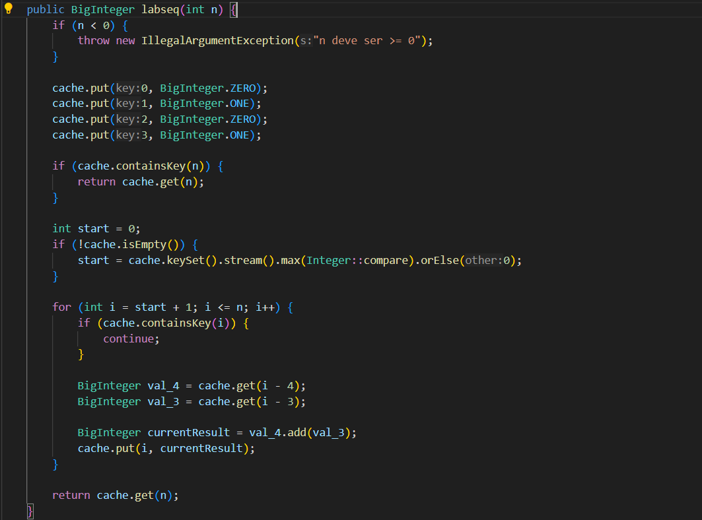
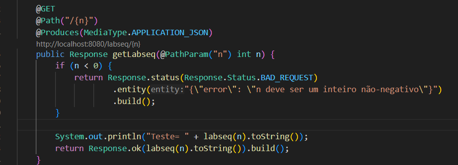

# LabSeq REST API + Frontend (Quarkus + Angular)

Este projeto consiste numa aplicação composta por uma **API REST**, desenvolvida com **Quarkus**, e um **frontend** simples em **Angular**, que em conjunto permitem calcular e visualizar o valor da sequência `labseq` para um determinado número inteiro não-negativo `n`.

---

## Funcionamento Geral

### Backend (Quarkus)

- Expõe um endpoint REST que recebe um número `n` e devolve o valor correspondente da sequência `labseq`.
- O valor é devolvido como **string JSON**, facilitando a sua visualização no frontend.
- Utiliza a classe `BigInteger` para suportar valores extremamente grandes.
- Implementa o algoritmo `ConcurrentHashMap` para evitar cálculos repetidos e armazena calculos já realizados para permitir calculos mais rápidos no futuro.

### Frontend (Angular)

- Permite ao utilizador introduzir o valor de `n`.
- Envia esse valor ao backend via HTTP e apresenta o resultado.
- O valor é tratado como string para garantir compatibilidade com números de grande dimensão.

---

## Metodos

 Este método é responsável pelo cálculo da sequência labseq.
 É utilizado internamente pelo método REST e inclui os seguintes comportamentos:

 - Inicializa por defeito os quatro primeiros valores da sequência (labseq(0), labseq(1), labseq(2), labseq(3)), conforme definido no problema.

 - Se o valor de n já tiver sido calculado anteriormente, é devolvido diretamente da cache.

Caso contrário:

 - Identifica o maior valor já existente na cache.

 - Calcula iterativamente todos os valores desde esse ponto até n, armazenando-os na cache para futuras chamadas.

 Este é o método exposto como endpoint REST do tipo GET, utilizado no frontend da aplicação. As suas principais funcionalidades são:

- Recebe como parâmetro o valor de n, fornecido pelo utilizador no frontend.

- Invoca o método de cálculo da sequência (labseq(n)).

- Retorna o resultado como uma string JSON, para garantir compatibilidade com números de grande dimensão e facilitar a sua exibição no frontend.

---

## Como Utilizar

Executar Backend
- mvn quarkus:dev 

Executar Frontend
- npm install
- ng serve

Para aceder ao REST API documentation basta executar
- http://localhost:8080/q/swagger-ui

Para Executar os testes unitários e de integração basta executar
- mvn test

